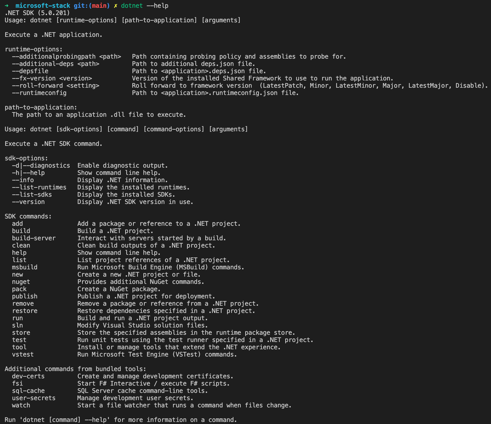
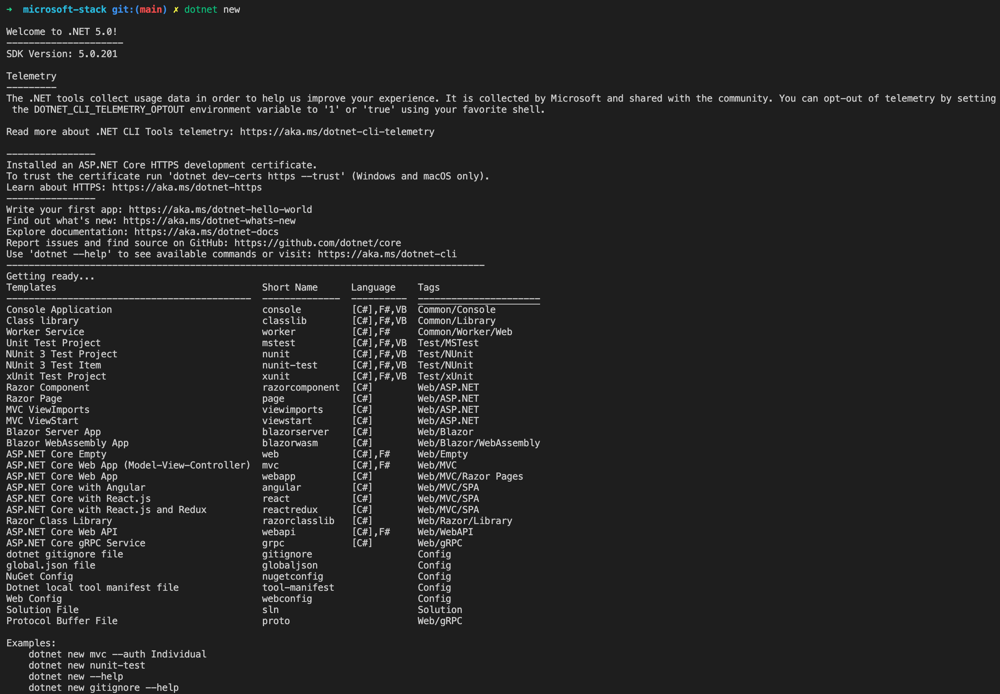

# [C# Fundamentals, Scott Allen, 2019-04-19](https://app.pluralsight.com/library/courses/csharp-fundamentals-dev/table-of-contents)

## Course Overview

### [Course Overview](https://app.pluralsight.com/course-player?courseId=0096b00d-2398-435a-82f7-3f5401408ab1)

## Introducing C# and .NET

### [Introduction](https://app.pluralsight.com/course-player?clipId=a378cd76-5548-4933-8f1c-b233c7b8afae)

### [Downloading .NET for Windows, macOS, and Linux](https://app.pluralsight.com/course-player?clipId=8cef35a5-f454-451d-9491-deb7f63e5490)

- Download .NET Core SDK.

  ```sh
  brew install --cask dotnet-sdk
  ```

  - This course will use .NET Core 2.2 and Visual Studio Code.

### [Understanding .NET and .NET Core](https://app.pluralsight.com/course-player?clipId=4c54ddad-471d-4bfe-8090-311d38545017)

- Two different .NETs:
  - ".NET" or ".NET Framework"
    - Works only on Windows (pre-installed).
    - Since around 2001.
  - ".NET Core"
    - Completely open source
    - Works across platforms (Linux, Mac, Windows, ARM)
    - Preferable for new projects.

### [Understanding the .NET Runtime and Framework](https://app.pluralsight.com/course-player?clipId=38c37661-0267-47f0-b1a6-0ae28c7d7e09)

- 2 pieces comprise .NET
  - CLR (Common Language **Runtime**)
    - Also supports
      - Visual Basic .NET
      - F#
      - Others
  - FCL (Framework Class **Library**)

### [Using the .NET Command Line Interface](https://app.pluralsight.com/course-player?clipId=261da5d1-79c0-4f07-968a-1ee68e7f88c1)

- Command Prompt or terminal

  ```sh
  dotnet
  # Helpful environment troubleshooting information:
  dotnet --info
  # View SDK commands:
  dotnet --help
  ```

  - 
  - 
  - ASP.NET Core
    - Web framework build on top of .NET Core
  - We'll create a console application

### [Creating the First C# Project](https://app.pluralsight.com/course-player?clipId=6f7ace43-04f7-46c0-8d7a-daf731e14c5f)

```bat
dotnet new
mkdir gradebook
cd gradebook
dir
mkdir src
mkdir test
cd src
mkdir GradeBook
cd Gradebook
dotnet new console
```

- Creates a set of files
  - `GradeBook.csproj`
    - `.csproj` indicates this is a C# project.
  - `Program.cs`
    - Contains C# source code that's already part of the console application.
- Running `dotnet run`:
  - Looks inside the current directory for a `.csproj` file.
  - Attempts to execute code in project.

### [Editing C# Code with Visual Studio Code](https://app.pluralsight.com/course-player?clipId=69fab3ca-7372-4b67-8cd0-80d91c1fa005)

```bat
..\..\
code .
```

- Add extension
  - Add `C#` extension.
  - Should receive prompt: `Required assets to build and debug are missing from 'gradebook'. Add them?`
    - Click `Yes`.
- Open `Program.cs`:

  ```cs
  using System;

  namespace GradeBook
  {
      class Program
      {
          static void Main(string[] args)
          {
              Console.WriteLine("Hello World!");
          }
      }
  }
  ```

  ```cs
  using System;

  namespace GradeBook
  {
      class Program
      {
          static void Main(string[] args)
          {
              Console.WriteLine("Hello Eric!");
          }
      }
  }
  ```

  ```sh
  dotnet run --project src/GradeBook
  ```

  ```bat
  dotnet run --project src\GradeBook
  ```

### [Running and Building Your Project](https://app.pluralsight.com/course-player?clipId=14bf9a2b-63b9-4873-a1c0-4c507e9790be)

- When doing a `dotnet run`:
  - Behind the scenes, a `dotnet restore` runs.
    - Get dependencies.
    - Package system: NuGet
    - Packages are available via a package feed.
    - The `.csproj` file records these packages.
  - Then: `dotnet build`.
    - Compile source code (to binary `.dll` file) into `bin/Debug`.
      - Not a dynamic link library. Better to think of it as an assembly.
- `obj` folder: Temporary object files from restore/build process.
- If we try to execute the `.dll` file in Windows, it encounters an error: `Could not load file or assembly`.
  - We need the runtime.
  - Could pass `.dll` file as argument to `dotnet`.

### [Saying Hello with C#](https://app.pluralsight.com/course-player?clipId=886b9135-7167-448b-a8ef-85028dab676c)

- Goal: Be able to pass name as a parameter to the console application.

```cs
using System;

namespace GradeBook
{
  class Program
  {
    // Main method: conventional entry point.
    static void Main(string[] args)
    {
      Console.WriteLine("Hello Eric!");
    }
  }
}
```

```cs
using System;

namespace GradeBook
{
  class Program
  {
    static void Main(string[] args)
    {
      // Concatenation:
      //   Console.WriteLine("Hello " + args[0] + "!");
      // String interpolation:
      Console.WriteLine($"Hello, {args[0]}!");
    }
  }
}
```

- Note that passing an argument to `dotnet run` passes it to the CLI, not to the application.
  - Argument passed to CLI:
    - `dotnet run Eric`
  - Argument passed to application:
    - `dotnet run -- Eric`

```sh
dotnet run --project src/GradeBook Eric
```

### [Debugging a C# Application](https://app.pluralsight.com/course-player?clipId=f18927ec-476a-482a-b692-d5f3d3512fca)

- .NET runtime crashes for unhandled exceptions.
  - Add breakpoint for `Console.WriteLine($"Hello, {args[0]}!");`.
  - Navigate to `Debug` (or `Run`)> `Start Debugging`.
    - Shortcut: F5.
    - Shortcut to stop debugging: Shift + F5

```cs
using System;

namespace GradeBook
{
  class Program
  {
    static void Main(string[] args)
    {
      if (args.Length > 0)
      {
        Console.WriteLine($"Hello, {args[0]}!");
      }
      else
      {
        Console.WriteLine("Hello!");
      }
    }
  }
}
```

- In `.vscode/launch.json`, note `configuration.args`. Can use to pass args while debugging.

  ```json
  {
    "version": "0.2.0",
    "configurations": [
      {
        // Use IntelliSense to find out which attributes exist for C# debugging
        // Use hover for the description of the existing attributes
        // For further information visit https://github.com/OmniSharp/omnisharp-vscode/blob/master/debugger-launchjson.md
        "name": ".NET Core Launch (console)",
        "type": "coreclr",
        "request": "launch",
        "preLaunchTask": "build",
        // If you have changed target frameworks, make sure to update the program path.
        "program": "${workspaceFolder}/c#/pluralsight/c#-fundamentals/gradebook/src/GradeBook/bin/Debug/net5.0/GradeBook.dll",
        "args": [],
        "cwd": "${workspaceFolder}/c#/pluralsight/c#-fundamentals/gradebook/src/GradeBook",
        // For more information about the 'console' field, see https://aka.ms/VSCode-CS-LaunchJson-Console
        "console": "internalConsole",
        "stopAtEntry": false
      },
      {
        "name": ".NET Core Attach",
        "type": "coreclr",
        "request": "attach",
        "processId": "${command:pickProcess}"
      }
    ]
  }
  ```

### [Summary](https://app.pluralsight.com/course-player?clipId=d889e0b6-67ec-41c1-b47f-e84c927367b0)

## Learning the C# Syntax

### Introduction

### Reviewing Your Assignment

### Working with Code Blocks and Statements

### Adding Numbers and Creating Arrays

### Looping through Arrays

### Using a List

### Computing and Formatting the Result

### Summary

## Working with Classes and Objects

### Introduction

### Creating a Class

### Adding State and Behavior

### Defining a Method

### Defining a Field

### Adding a Constructor

### Requiring Constructor Parameters

### Working with Static Members

### Computing Statistics

### Solving the Statistics Challenge

### Summary

## Testing Your Code

### Introduction

### The Many Benefits of Unit Testing

### Creating a Unit Test Project

### Writing and Running a Test

### Referencing Projects and Packages

### Refactoring for Testability

### Summary

## Working with Reference Types and Value Types

### Introduction

### Reference Types and Value Types

### Creating a Solution File

### Testing Object References

### Referencing Different Objects

### Passing Parameters by Value

### Returning Object References

### Passing Parameters by Reference

### Working with Value Types

### Value Type Parameters

### Looking for Reference Types and Value Types

### The Special Case of Strings in .NET

### Taking Advantage of Garbage Collection

### Summary

## Controlling the Flow of Execution

### Introduction

### Branching with if Statements

### Looping with for, foreach, do, and while

### Jumping with break and continue

### Switching with the switch Statement

### Pattern Matching with switch

### Challenge: Taking User Input from the Console

### One Solution

### Throwing Exceptions

### Catching Exceptions

### Summary

## Building Types

### Introduction

### Overloading Methods

### Defining Properties

### Defining Property Getters and Setters

### Defining readonly Members

### Defining const Members

### Introducing Events and Delegates

### Defining a Delegate

### Using Multi-cast Delegates

### Defining an Event

### Subscribing to an Event

### Summary

## Object-oriented Programming with C#

### Introduction

### The Pillars of OOP

### Deriving from a Base Class

### Chaining Constructors

### Deriving from System.Object

### Setting up a Scenario

### Defining an Abstract Class

### Defining an Interface

### Writing Grades to a File

### Using IDisposable

### A Statistical Challenge

### Refactoring Statistics

### Summary

## Catching up with the Latest in C#

### Introduction

### Working with Non-nullable Reference Types

### Summary

### Going Further with C#

### Introduction

### Generics

### Async C#

### LINQ

### Effective C#
