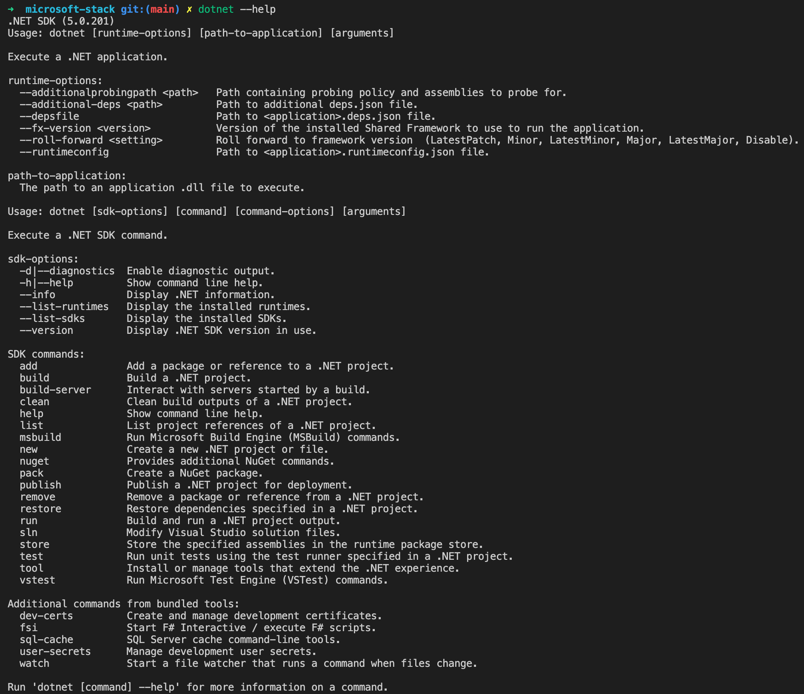
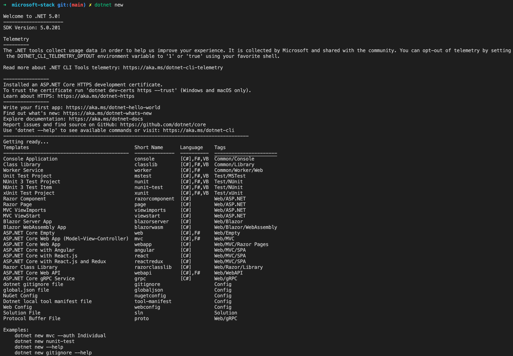

# [C# Fundamentals, Scott Allen, 2019-04-19](https://app.pluralsight.com/library/courses/csharp-fundamentals-dev/table-of-contents)

- [C# Fundamentals, Scott Allen, 2019-04-19](#c-fundamentals-scott-allen-2019-04-19)
  - [Course Overview](#course-overview)
    - [Course Overview](#course-overview-1)
  - [Introducing C# and .NET](#introducing-c-and-net)
    - [Introduction](#introduction)
    - [Downloading .NET for Windows, macOS, and Linux](#downloading-net-for-windows-macos-and-linux)
    - [Understanding .NET and .NET Core](#understanding-net-and-net-core)
    - [Understanding the .NET Runtime and Framework](#understanding-the-net-runtime-and-framework)
    - [Using the .NET Command Line Interface](#using-the-net-command-line-interface)
    - [Creating the First C# Project](#creating-the-first-c-project)
    - [Editing C# Code with Visual Studio Code](#editing-c-code-with-visual-studio-code)
    - [Running and Building Your Project](#running-and-building-your-project)
    - [Saying Hello with C#](#saying-hello-with-c)
    - [Debugging a C# Application](#debugging-a-c-application)
    - [Summary](#summary)
  - [Learning the C# Syntax](#learning-the-c-syntax)
    - [Introduction](#introduction-1)
    - [Reviewing Your Assignment](#reviewing-your-assignment)
    - [Working with Code Blocks and Statements](#working-with-code-blocks-and-statements)
    - [Adding Numbers and Creating Arrays](#adding-numbers-and-creating-arrays)
    - [Looping through Arrays](#looping-through-arrays)
    - [Using a List](#using-a-list)
    - [Computing and Formatting the Result](#computing-and-formatting-the-result)
    - [Summary](#summary-1)
  - [Working with Classes and Objects](#working-with-classes-and-objects)
    - [Introduction](#introduction-2)
    - [Creating a Class](#creating-a-class)
    - [Adding State and Behavior](#adding-state-and-behavior)
    - [Defining a Method](#defining-a-method)
    - [Defining a Field](#defining-a-field)
    - [Adding a Constructor](#adding-a-constructor)
    - [Requiring Constructor Parameters](#requiring-constructor-parameters)
    - [Working with Static Members](#working-with-static-members)
    - [Computing Statistics](#computing-statistics)
    - [Solving the Statistics Challenge](#solving-the-statistics-challenge)
    - [Summary](#summary-2)
  - [Testing Your Code](#testing-your-code)
    - [Introduction](#introduction-3)
    - [The Many Benefits of Unit Testing](#the-many-benefits-of-unit-testing)
    - [Creating a Unit Test Project](#creating-a-unit-test-project)
    - [Writing and Running a Test](#writing-and-running-a-test)
    - [Referencing Projects and Packages](#referencing-projects-and-packages)
    - [Refactoring for Testability](#refactoring-for-testability)
    - [Summary](#summary-3)
  - [Working with Reference Types and Value Types](#working-with-reference-types-and-value-types)
    - [Introduction](#introduction-4)
    - [Reference Types and Value Types](#reference-types-and-value-types)
    - [Creating a Solution File](#creating-a-solution-file)
    - [Testing Object References](#testing-object-references)
    - [Referencing Different Objects](#referencing-different-objects)
    - [Passing Parameters by Value](#passing-parameters-by-value)
    - [Returning Object References](#returning-object-references)
    - [Passing Parameters by Reference](#passing-parameters-by-reference)
    - [Working with Value Types](#working-with-value-types)
    - [Value Type Parameters](#value-type-parameters)
    - [Looking for Reference Types and Value Types](#looking-for-reference-types-and-value-types)
    - [The Special Case of Strings in .NET](#the-special-case-of-strings-in-net)
    - [Taking Advantage of Garbage Collection](#taking-advantage-of-garbage-collection)
    - [Summary](#summary-4)
  - [Controlling the Flow of Execution](#controlling-the-flow-of-execution)
    - [Introduction](#introduction-5)
    - [Branching with if Statements](#branching-with-if-statements)
    - [Looping with for, foreach, do, and while](#looping-with-for-foreach-do-and-while)
    - [Jumping with break and continue](#jumping-with-break-and-continue)
    - [Switching with the switch Statement](#switching-with-the-switch-statement)
    - [Pattern Matching with switch](#pattern-matching-with-switch)
    - [Challenge: Taking User Input from the Console](#challenge-taking-user-input-from-the-console)
    - [One Solution](#one-solution)
    - [Throwing Exceptions](#throwing-exceptions)
    - [Catching Exceptions](#catching-exceptions)
    - [Summary](#summary-5)
  - [Building Types](#building-types)
    - [Introduction](#introduction-6)
    - [Overloading Methods](#overloading-methods)
    - [Defining Properties](#defining-properties)
    - [Defining Property Getters and Setters](#defining-property-getters-and-setters)
    - [Defining readonly Members](#defining-readonly-members)
    - [Defining const Members](#defining-const-members)
    - [Introducing Events and Delegates](#introducing-events-and-delegates)
    - [Defining a Delegate](#defining-a-delegate)
    - [Using Multi-cast Delegates](#using-multi-cast-delegates)
    - [Defining an Event](#defining-an-event)
    - [Subscribing to an Event](#subscribing-to-an-event)
    - [Summary](#summary-6)
  - [Object-oriented Programming with C](#object-oriented-programming-with-c)
    - [Introduction](#introduction-7)
    - [The Pillars of OOP](#the-pillars-of-oop)
    - [Deriving from a Base Class](#deriving-from-a-base-class)
    - [Chaining Constructors](#chaining-constructors)
    - [Deriving from System.Object](#deriving-from-systemobject)
    - [Setting up a Scenario](#setting-up-a-scenario)
    - [Defining an Abstract Class](#defining-an-abstract-class)
    - [Defining an Interface](#defining-an-interface)
    - [Writing Grades to a File](#writing-grades-to-a-file)
    - [Using IDisposable](#using-idisposable)
    - [A Statistical Challenge](#a-statistical-challenge)
    - [Refactoring Statistics](#refactoring-statistics)
    - [Summary](#summary-7)
  - [Catching up with the Latest in C](#catching-up-with-the-latest-in-c)
    - [Introduction](#introduction-8)
    - [Working with Non-nullable Reference Types](#working-with-non-nullable-reference-types)
    - [Summary](#summary-8)
    - [Going Further with C](#going-further-with-c)
    - [Introduction](#introduction-9)
    - [Generics](#generics)
    - [Async C](#async-c)
    - [LINQ](#linq)
    - [Effective C](#effective-c)

## Course Overview

### [Course Overview](https://app.pluralsight.com/course-player?courseId=0096b00d-2398-435a-82f7-3f5401408ab1)

## Introducing C# and .NET

### [Introduction](https://app.pluralsight.com/course-player?clipId=a378cd76-5548-4933-8f1c-b233c7b8afae)

### [Downloading .NET for Windows, macOS, and Linux](https://app.pluralsight.com/course-player?clipId=8cef35a5-f454-451d-9491-deb7f63e5490)

- Download .NET Core SDK.

  ```sh
  brew install --cask dotnet-sdk
  ```

  - This course will use .NET Core 2.2 and Visual Studio Code.

### [Understanding .NET and .NET Core](https://app.pluralsight.com/course-player?clipId=4c54ddad-471d-4bfe-8090-311d38545017)

- Two different .NETs:
  - ".NET" or ".NET Framework"
    - Works only on Windows (pre-installed).
    - Since around 2001.
  - ".NET Core"
    - Completely open source
    - Works across platforms (Linux, Mac, Windows, ARM)
    - Preferable for new projects.

### [Understanding the .NET Runtime and Framework](https://app.pluralsight.com/course-player?clipId=38c37661-0267-47f0-b1a6-0ae28c7d7e09)

- 2 pieces comprise .NET
  - CLR (Common Language **Runtime**)
    - Also supports
      - Visual Basic .NET
      - F#
      - Others
  - FCL (Framework Class **Library**)

### [Using the .NET Command Line Interface](https://app.pluralsight.com/course-player?clipId=261da5d1-79c0-4f07-968a-1ee68e7f88c1)

- Command Prompt or terminal

  ```sh
  dotnet
  # Helpful environment troubleshooting information:
  dotnet --info
  # View SDK commands:
  dotnet --help
  ```

  - 
  - 
  - ASP.NET Core
    - Web framework build on top of .NET Core
  - We'll create a console application

### [Creating the First C# Project](https://app.pluralsight.com/course-player?clipId=6f7ace43-04f7-46c0-8d7a-daf731e14c5f)

```bat
dotnet new
mkdir gradebook
cd gradebook
dir
mkdir src
mkdir test
cd src
mkdir GradeBook
cd Gradebook
dotnet new console
```

- Creates a set of files
  - `GradeBook.csproj`
    - `.csproj` indicates this is a C# project.
  - `Program.cs`
    - Contains C# source code that's already part of the console application.
- Running `dotnet run`:
  - Looks inside the current directory for a `.csproj` file.
  - Attempts to execute code in project.

### [Editing C# Code with Visual Studio Code](https://app.pluralsight.com/course-player?clipId=69fab3ca-7372-4b67-8cd0-80d91c1fa005)

```bat
..\..\
code .
```

- Add extension
  - Add `C#` extension.
  - Should receive prompt: `Required assets to build and debug are missing from 'gradebook'. Add them?`
    - Click `Yes`.
- Open `Program.cs`:

  ```cs
  using System;

  namespace GradeBook
  {
      class Program
      {
          static void Main(string[] args)
          {
              Console.WriteLine("Hello World!");
          }
      }
  }
  ```

  ```cs
  using System;

  namespace GradeBook
  {
      class Program
      {
          static void Main(string[] args)
          {
              Console.WriteLine("Hello Eric!");
          }
      }
  }
  ```

  ```sh
  dotnet run --project src/GradeBook
  ```

  ```bat
  dotnet run --project src\GradeBook
  ```

### [Running and Building Your Project](https://app.pluralsight.com/course-player?clipId=14bf9a2b-63b9-4873-a1c0-4c507e9790be)

- When doing a `dotnet run`:
  - Behind the scenes, a `dotnet restore` runs.
    - Get dependencies.
    - Package system: NuGet
    - Packages are available via a package feed.
    - The `.csproj` file records these packages.
  - Then: `dotnet build`.
    - Compile source code (to binary `.dll` file) into `bin/Debug`.
      - Not a dynamic link library. Better to think of it as an assembly.
- `obj` folder: Temporary object files from restore/build process.
- If we try to execute the `.dll` file in Windows, it encounters an error: `Could not load file or assembly`.
  - We need the runtime.
  - Could pass `.dll` file as argument to `dotnet`.

### [Saying Hello with C#](https://app.pluralsight.com/course-player?clipId=886b9135-7167-448b-a8ef-85028dab676c)

- Goal: Be able to pass name as a parameter to the console application.

```cs
using System;

namespace GradeBook
{
  class Program
  {
    // Main method: conventional entry point.
    static void Main(string[] args)
    {
      Console.WriteLine("Hello Eric!");
    }
  }
}
```

```cs
using System;

namespace GradeBook
{
  class Program
  {
    static void Main(string[] args)
    {
      // Concatenation:
      //   Console.WriteLine("Hello " + args[0] + "!");
      // String interpolation:
      Console.WriteLine($"Hello, {args[0]}!");
    }
  }
}
```

- Note that passing an argument to `dotnet run` passes it to the CLI, not to the application.
  - Argument passed to CLI:
    - `dotnet run Eric`
  - Argument passed to application:
    - `dotnet run -- Eric`

```sh
dotnet run --project src/GradeBook Eric
```

### [Debugging a C# Application](https://app.pluralsight.com/course-player?clipId=f18927ec-476a-482a-b692-d5f3d3512fca)

- .NET runtime crashes for unhandled exceptions.
  - Add breakpoint for `Console.WriteLine($"Hello, {args[0]}!");`.
  - Navigate to `Debug` (or `Run`)> `Start Debugging`.
    - Shortcut: F5.
    - Shortcut to stop debugging: Shift + F5

```cs
using System;

namespace GradeBook
{
  class Program
  {
    static void Main(string[] args)
    {
      if (args.Length > 0)
      {
        Console.WriteLine($"Hello, {args[0]}!");
      }
      else
      {
        Console.WriteLine("Hello!");
      }
    }
  }
}
```

- In `.vscode/launch.json`, note `configuration.args`. Can use to pass args while debugging.

  ```json
  {
    "version": "0.2.0",
    "configurations": [
      {
        // Use IntelliSense to find out which attributes exist for C# debugging
        // Use hover for the description of the existing attributes
        // For further information visit https://github.com/OmniSharp/omnisharp-vscode/blob/master/debugger-launchjson.md
        "name": ".NET Core Launch (console)",
        "type": "coreclr",
        "request": "launch",
        "preLaunchTask": "build",
        // If you have changed target frameworks, make sure to update the program path.
        "program": "${workspaceFolder}/c#/pluralsight/c#-fundamentals/gradebook/src/GradeBook/bin/Debug/net5.0/GradeBook.dll",
        "args": [],
        "cwd": "${workspaceFolder}/c#/pluralsight/c#-fundamentals/gradebook/src/GradeBook",
        // For more information about the 'console' field, see https://aka.ms/VSCode-CS-LaunchJson-Console
        "console": "internalConsole",
        "stopAtEntry": false
      },
      {
        "name": ".NET Core Attach",
        "type": "coreclr",
        "request": "attach",
        "processId": "${command:pickProcess}"
      }
    ]
  }
  ```

### [Summary](https://app.pluralsight.com/course-player?clipId=d889e0b6-67ec-41c1-b47f-e84c927367b0)

## Learning the C# Syntax

### [Introduction](https://app.pluralsight.com/course-player?clipId=0fc3d387-1e0d-4b88-a382-22efd53e7e6b)

### [Reviewing Your Assignment](https://app.pluralsight.com/course-player?clipId=f2a753fd-4a09-4c4c-a413-dcce3600ef58)

### [Working with Code Blocks and Statements](https://app.pluralsight.com/course-player?clipId=bf07edc2-f7d6-4812-8311-f648c97aaa02)

- Implicit typing (with initialization) &rarr; `var`
- Look up VS Code C# snippets.

### Adding Numbers and Creating Arrays

### [Looping through Arrays](https://app.pluralsight.com/course-player?clipId=3f7b7f5e-8a98-418c-8733-45ebdfcf094c)

- Array initialization syntax:
  - `var numbers = new double[3] { 12.7, 10.3, 6.11 };`
  - `var numbers = new[] { 12.7, 10.3, 6.11 };`
- `foreach`:

  ```cs
  var numbers = new[] { 12.7, 10.3, 6.11 };

  var result = 0.0;
  foreach (double number in numbers)
  {
    result += number;
  }
  ```

### [Using a List](https://app.pluralsight.com/course-player?clipId=3b8df66f-fd24-45c5-86b3-208b16106710)

- Access VS Code suggested fixed: Cmd + . (or Windows: Control + .).
- Arrays are fixed-length.
  - Data structures (list, stack, queue):
    - `Systems.Collections.Generic`
- List initialization:
  - `List<double> grades = new List<double>();`
  - `var grades = new List<double>() { 12.7, 10.3, 6.11, 4.1 };`

### [Computing and Formatting the Result](https://app.pluralsight.com/course-player?clipId=c5be9427-7586-4cc9-8f83-dc4aa4206352)

- Format as number with 1 digit after decimal:
  - `Console.WriteLine($"The average grade is {result:N1}");`

### [Summary](https://app.pluralsight.com/course-player?clipId=a45d2ba2-b1f4-4d7e-b249-85bb19ca9748)

```cs
using System;
using System.Collections.Generic;

namespace GradeBook
{
  class Program
  {
    static void Main(string[] args)
    {
      var grades = new List<double>() { 12.7, 10.3, 6.11, 4.1 };
      grades.Add(56.1);

      var result = 0.0;
      foreach (double number in grades)
      {
        result += number;
      }
      result /= grades.Count;
      Console.WriteLine($"The average grade is {result:N1}");

      if (args.Length > 0)
      {
        Console.WriteLine($"Hello, {args[0]}!");
      }
      else
      {
        Console.WriteLine("Hello!");
      }
    }
  }
}
```

## Working with Classes and Objects

### [Introduction](https://app.pluralsight.com/course-player?clipId=1acccfd3-3a64-4719-9bbb-8dc3a43b1c64)

### [Creating a Class](https://app.pluralsight.com/course-player?clipId=893b69a0-e3a1-4807-a1fb-0d966614fcd1)

- Code should almost always be inside a defined `namespace`; otherwise, we're in the global namespace.

  ```cs
  namespace GradeBook
  {
    class Program
    {
      // ...
    }
  }
  ```

- Microsoft libraries are often in the `System` namespace.
- Allen prefers to never see namespaces in the code.

### [Adding State and Behavior](https://app.pluralsight.com/course-player?clipId=219579ef-110d-476a-ba4e-ef31d97a1b8f)

- Convention: 1 class per file
  - Class: state + behavior
- Add `src/GradeBook/Book.cs`:

  ```cs
  namespace GradeBook {
      class Book {

    }
  }
  ```

### [Defining a Method](https://app.pluralsight.com/course-player?clipId=a0d44461-bcb4-4c65-be0c-ba202e7abe4d)

- `src/GradeBook/Program.cs`:

  ```cs
  using System;
  using System.Collections.Generic;

  namespace GradeBook
  {
    class Program
    {
      static void Main(string[] args)
      {
        var book = new Book();
        book.AddGrade(89.1);

        var grades = new List<double>() { 12.7, 10.3, 6.11, 4.1 };
        grades.Add(56.1);

        var result = 0.0;
        foreach (double number in grades)
        {
          result += number;
        }
        result /= grades.Count;
        Console.WriteLine($"The average grade is {result:N1}");
      }
    }
  }
  ```

- `src/GradeBook/Book.cs`

  ```cs
  namespace GradeBook
  {
    class Book
    {
      public void AddGrade(double grade)
      {

      }
    }
  }
  ```

### [Defining a Field](https://app.pluralsight.com/course-player?clipId=4e7eb476-1b9f-4f81-8eee-f81365bc0c13)

- Note that a field cannot use implicit typing.

### [Adding a Constructor](https://app.pluralsight.com/course-player?clipId=a96054ab-76de-4a61-869f-89d38afcc278)

- We'll define an explicit constructor (vs. an implicit constructor provided by the complier).

```cs

using System.Collections.Generic;

namespace GradeBook
{
  class Book
  {
    public Book()
    {
      grades = new List<double>();
    }

    public void AddGrade(double grade)
    {
      grades.Add(grade);
    }

    List<double> grades;
  }
}
```

### [Requiring Constructor Parameters](https://app.pluralsight.com/course-player?clipId=a6b14802-c5e7-4952-a99b-a6c1e3f642f7)

- Access modifiers
  - `public`
  - `private`
- `this` is an implicit variable always available inside constructors and methods.

### [Working with Static Members](https://app.pluralsight.com/course-player?clipId=6ceaa039-c943-4408-b637-a7b9b8c7c792)

- Opposite of a static method: An instance member.
- Statics are not associate with an object instance; they're associated with the type they're defined inside of.

### [Computing Statistics](https://app.pluralsight.com/course-player?clipId=619ab8b5-efb5-4540-a025-18b431dd5b0d)

### [Solving the Statistics Challenge](https://app.pluralsight.com/course-player?clipId=15d69e29-75ff-4639-b1c8-24f6f4a9e3fe)

### [Summary](https://app.pluralsight.com/course-player?clipId=8ac5b526-98e5-4e00-b4d7-bce718d504a8)

- `Program.cs`:

  ```cs
  namespace GradeBook
  {
    class Program
    {
      static void Main(string[] args)
      {

        var book = new Book("Scott's Grade Book");
        book.AddGrade(89.1);
        book.AddGrade(90.5);
        book.AddGrade(77.5);
        book.ShowStatistics();
      }
    }
  }
  ```

- `Book.cs`:

  ```cs
  using System;
  using System.Collections.Generic;

  namespace GradeBook
  {
    class Book
    {
      public Book(string name)
      {
        grades = new List<double>();
        this.name = name;
      }

      public void AddGrade(double grade)
      {
        grades.Add(grade);
      }

      public void ShowStatistics()
      {
        var result = 0.0;
        var lowestGrade = double.MaxValue;
        var highestGrade = double.MinValue;
        foreach (double number in grades)
        {
          lowestGrade = Math.Min(number, lowestGrade);
          highestGrade = Math.Max(number, highestGrade);
          result += number;
        }
        result /= grades.Count;
        Console.WriteLine($"The highest grade is {highestGrade:N1}");
        Console.WriteLine($"The lowest grade is {lowestGrade:N1}");
        Console.WriteLine($"The average grade is {result:N1}");
      }

      private List<double> grades;
      private string name;
    }
  }
  ```

## Testing Your Code

### [Introduction](https://app.pluralsight.com/course-player?clipId=54eb1aab-f19e-4828-b4cd-761873608479)

### [The Many Benefits of Unit Testing](https://app.pluralsight.com/course-player?clipId=6c9113dd-8203-4108-842f-3dc749b6282c)

- We'll use xUnit.net

### [Creating a Unit Test Project](https://app.pluralsight.com/course-player?clipId=0d26192f-9623-411c-b325-a0ea09e3f33c)

- Convention: Write tests in a separate project.

  ```sh
  cd test
  mkdir GradeBook.Tests
  cd GradeBook.Tests
  dotnet new xunit
  ```

  - xUnit is a NuGet package; not part of .NET Core.

    - Using `dotnet new xunit` handled this already for us:

      - https://www.nuget.org/packages/xunit/

        ```sh
        dotnet add package xunit --version 2.4.1
        ```

- `test/GradeBook.Tests/GradeBook.Tests.csproj`:

  ```xml
  <Project Sdk="Microsoft.NET.Sdk">

    <PropertyGroup>
      <TargetFramework>net5.0</TargetFramework>

      <IsPackable>false</IsPackable>
    </PropertyGroup>

    <ItemGroup>
      <PackageReference Include="Microsoft.NET.Test.Sdk" Version="16.7.1" />
      <PackageReference Include="xunit" Version="2.4.1" />
      <PackageReference Include="xunit.runner.visualstudio" Version="2.4.3">
        <IncludeAssets>runtime; build; native; contentfiles; analyzers; buildtransitive</IncludeAssets>
        <PrivateAssets>all</PrivateAssets>
      </PackageReference>
      <PackageReference Include="coverlet.collector" Version="1.3.0">
        <IncludeAssets>runtime; build; native; contentfiles; analyzers; buildtransitive</IncludeAssets>
        <PrivateAssets>all</PrivateAssets>
      </PackageReference>
    </ItemGroup>

  </Project>
  ```

### [Writing and Running a Test](https://app.pluralsight.com/course-player?clipId=13461d51-f9df-422d-95a9-98da47b1c741)

- The new xUnit project created `test/GradeBook.Tests/UnitTest1.cs`:

  ```cs
  using System;
  // Bring in Xunit namespace.
  using Xunit;

  namespace GradeBook.Tests
  {
      public class UnitTest1
      {
          // `[Fact]` is an attribute. It's attached to the following symbol. xUnit looks for methods with the [Fact] attribute.
          [Fact]
          public void Test1()
          {

          }
      }
  }
  ```

- Install .NET Core unit text extension.
- .NET CLI includes a test runner:

  ```cs
  dotnet test
  ```

- Unit test essence:

  ```cs
  using System;
  using Xunit;

  namespace GradeBook.Tests
  {
    public class UnitTest1
    {
      [Fact]
      public void Test1()
      {
        // arrange
        var x = 5;
        var y = 2;
        var expected = 7;

        // act
        var actual = x + y;

        // assert
        Assert.Equal(expected, actual);
      }
    }
  }
  ```

### [Referencing Projects and Packages](https://app.pluralsight.com/course-player?clipId=2dfff216-dc41-4d34-87e5-8e2d3d783b3a)

- Convention: File name should match test (class) name.
- CLI: Add a project-to-project reference (so we can pull Book into the test project).

  ```sh
  dotnet add reference ../../src/GradeBook/GradeBook.csproj
  ```

- Adds a project reference to `GradeBook.Tests.csproj`:

  ```xml
  <Project Sdk="Microsoft.NET.Sdk">

    <PropertyGroup>
      <TargetFramework>net5.0</TargetFramework>

      <IsPackable>false</IsPackable>
    </PropertyGroup>

    <ItemGroup>
      <PackageReference Include="Microsoft.NET.Test.Sdk" Version="16.7.1" />
      <PackageReference Include="xunit" Version="2.4.1" />
      <PackageReference Include="xunit.runner.visualstudio" Version="2.4.3">
        <IncludeAssets>runtime; build; native; contentfiles; analyzers; buildtransitive</IncludeAssets>
        <PrivateAssets>all</PrivateAssets>
      </PackageReference>
      <PackageReference Include="coverlet.collector" Version="1.3.0">
        <IncludeAssets>runtime; build; native; contentfiles; analyzers; buildtransitive</IncludeAssets>
        <PrivateAssets>all</PrivateAssets>
      </PackageReference>
    </ItemGroup>

    <ItemGroup>
      <ProjectReference Include="..\..\src\GradeBook\GradeBook.csproj" />
    </ItemGroup>

  </Project>
  ```

- Default class access: `internal` (can only be used within the same project).
  - Need to add `public` so test can access `Book`.
- Because we are in a namespace underneath the `Book`'s namespace (i.e., `namespace GradeBook.Tests` is under `namespace GradeBook`), we don't need a `using` statement.

### [Refactoring for Testability](https://app.pluralsight.com/course-player?clipId=114ffe93-dcd9-4b40-bede-7ef7e17ad580)

- `ShowStatistics` currently computes grades and displays the result of the calculations.
- Note that the .NET runtime sets all fields of a class to 'all bits off' - so, for a floating point field, to `0.0`.
- Add `gradebook/src/GradeBook/Statistics.cs`:

  ```cs
  namespace GradeBook
  {
    public class Statistics
    {
      public double Average;
      public double High;
      public double Low;
    }
  }
  ```

- `gradebook/src/GradeBook/Book.cs`:

  ```cs

  using System;
  using System.Collections.Generic;

  namespace GradeBook
  {
    public class Book
    {
      public Book(string name)
      {
        grades = new List<double>();
        this.name = name;
      }

      public void AddGrade(double grade)
      {
        grades.Add(grade);
      }

      public Statistics GetStatistics()
      {
        var result = new Statistics();
        result.Average = 0.0;
        result.High = double.MinValue;
        result.Low = double.MaxValue;
        foreach (double grade in grades)
        {
          result.Low = Math.Min(grade, result.Low);
          result.High = Math.Max(grade, result.High);
          result.Average += grade;
        }
        result.Average /= grades.Count;

        return result;
      }

      private List<double> grades;
      private string name;
    }
  }
  ```

- `gradebook/src/GradeBook/Program.cs`:

  ```cs
  using System;
  namespace GradeBook
  {
    class Program
    {
      static void Main(string[] args)
      {

        var book = new Book("Scott's Grade Book");
        book.AddGrade(89.1);
        book.AddGrade(90.5);
        book.AddGrade(77.5);
        var stats = book.GetStatistics();

        Console.WriteLine($"The highest grade is {stats.High:N1}");
        Console.WriteLine($"The lowest grade is {stats.Low:N1}");
        Console.WriteLine($"The average grade is {stats.Average:N1}");
      }
    }
  }
  ```

- `gradebook/test/GradeBook.Tests/BookTests.cs`:

  ```cs
  using System;
  using Xunit;

  namespace GradeBook.Tests
  {
    public class BookTests
    {
      [Fact]
      public void Test1()
      {
        // arrange
        var book = new Book("");
        book.AddGrade(89.1);
        book.AddGrade(90.5);
        book.AddGrade(77.3);

        // act
        var result = book.GetStatistics();

        // assert
        // Assert.Equal to 1 decimal point of precision.
        Assert.Equal(85.6, result.Average, 1);
        Assert.Equal(90.5, result.High, 1);
        Assert.Equal(77.3, result.Low, 1);
      }
    }
  }
  ```

- Test with `dotnet test` from within `gradebook/test/GradeBook.Tests`.

### [Summary](https://app.pluralsight.com/course-player?clipId=f67b23bc-1c46-4ecf-9744-7f67bb8867fd)

## Working with Reference Types and Value Types

### Introduction

### Reference Types and Value Types

### Creating a Solution File

### Testing Object References

### Referencing Different Objects

### Passing Parameters by Value

### Returning Object References

### Passing Parameters by Reference

### Working with Value Types

### Value Type Parameters

### Looking for Reference Types and Value Types

### The Special Case of Strings in .NET

### Taking Advantage of Garbage Collection

### Summary

## Controlling the Flow of Execution

### Introduction

### Branching with if Statements

### Looping with for, foreach, do, and while

### Jumping with break and continue

### Switching with the switch Statement

### Pattern Matching with switch

### Challenge: Taking User Input from the Console

### One Solution

### Throwing Exceptions

### Catching Exceptions

### Summary

## Building Types

### Introduction

### Overloading Methods

### Defining Properties

### Defining Property Getters and Setters

### Defining readonly Members

### Defining const Members

### Introducing Events and Delegates

### Defining a Delegate

### Using Multi-cast Delegates

### Defining an Event

### Subscribing to an Event

### Summary

## Object-oriented Programming with C#

### Introduction

### The Pillars of OOP

### Deriving from a Base Class

### Chaining Constructors

### Deriving from System.Object

### Setting up a Scenario

### Defining an Abstract Class

### Defining an Interface

### Writing Grades to a File

### Using IDisposable

### A Statistical Challenge

### Refactoring Statistics

### Summary

## Catching up with the Latest in C#

### Introduction

### Working with Non-nullable Reference Types

### Summary

### Going Further with C#

### Introduction

### Generics

### Async C#

### LINQ

### Effective C#
